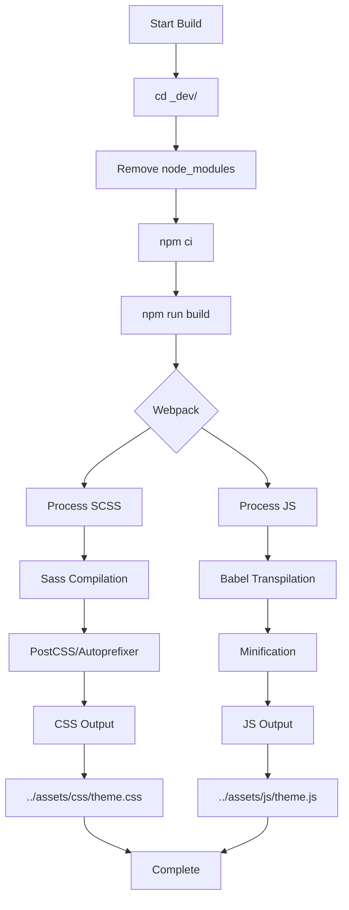

# Entretelas Theme Build System

## Overview
The Entretelas theme now has a complete webpack/npm build system, just like Hummingbird. This document explains the build infrastructure and how to use it.

## Build System Architecture

### Development Structure
```
themes/entretelas/
├── _dev/                         # Source files (not deployed)
│   ├── css/
│   │   ├── theme.scss           # Main SCSS entry point
│   │   └── entretelas-custom.scss # Custom Entretelas styles
│   ├── js/
│   │   ├── theme.js             # Main JS entry point
│   │   └── theme-base.js        # Base functionality
│   ├── package.json             # NPM dependencies & scripts
│   ├── webpack.config.js        # Webpack configuration
│   ├── postcss.config.js        # PostCSS/Autoprefixer
│   ├── .babelrc                 # Babel configuration
│   ├── .gitignore               # Ignore node_modules
│   └── README.md                # Dev documentation
├── assets/                       # Compiled output (deployed)
│   ├── css/
│   │   └── theme.css            # Compiled CSS
│   ├── js/
│   │   └── theme.js             # Compiled & minified JS
│   └── fonts/                   # Custom fonts
├── config/
│   └── theme.yml                # Theme metadata
├── templates/                    # Smarty templates
└── preview.png                   # Theme preview
```

### Build Tools

#### Webpack 5
- **Entry Points:** `css/theme.scss` and `js/theme.js`
- **Output:** `../assets/css/theme.css` and `../assets/js/theme.js`
- **Features:**
  - Code splitting
  - Asset optimization
  - Source maps (development mode)
  - Minification (production mode)

#### SCSS/Sass
- **Compiler:** Dart Sass via sass-loader
- **Features:**
  - SCSS syntax support
  - CSS concatenation
  - PostCSS processing
  - Autoprefixer for browser compatibility

#### Babel
- **Preset:** @babel/preset-env
- **Target:** Last 2 versions, > 1%, IE 11
- **Features:**
  - ES6+ transpilation
  - Module system transformation
  - Polyfills for older browsers

## Build Commands

### Install Dependencies
```bash
cd themes/entretelas/_dev
npm install
```

### Production Build
```bash
cd themes/entretelas/_dev
npm run build
```
Outputs optimized, minified assets to `../assets/`

### Development Build
```bash
cd themes/entretelas/_dev
npm run dev
```
Builds with source maps for debugging

### Watch Mode
```bash
cd themes/entretelas/_dev
npm run watch
```
Automatically rebuilds on file changes

## Integration with PrestaShop Build System

### Build Script
The theme integrates with PrestaShop's central build system via:

**File:** `tools/assets/build.sh`

```bash
front-entretelas)
  if should_build_asset "front-entretelas"; then
    echo ">>> Building entretelas theme assets..."
    build "$PROJECT_PATH/themes/entretelas/_dev"
  else
    echo "> Front entretelas already exists (use --force to rebuild)"
  fi
;;
```

The `build` function:
1. Changes to `themes/entretelas/_dev/`
2. Removes existing `node_modules/`
3. Runs `npm ci` (clean install)
4. Runs `npm run build`
5. Returns to original directory

### Makefile Targets

**Build all front themes (including Entretelas):**
```bash
make front
```

**Build only Entretelas:**
```bash
make front-entretelas
```

**Direct script usage:**
```bash
./tools/assets/build.sh front-entretelas
./tools/assets/build.sh front-entretelas --force
```

### Docker Integration

When Docker containers start or restart, the build process automatically:
1. Runs `docker_run_git.sh`
2. Calls `tools/assets/build.sh all`
3. Builds all themes including Entretelas
4. Outputs to `assets/` folders

## Build Process Flow



## Development Workflow

### Making Style Changes

1. **Edit source SCSS:**
   ```bash
   vim themes/entretelas/_dev/css/entretelas-custom.scss
   ```

2. **Rebuild:**
   ```bash
   cd themes/entretelas/_dev
   npm run build
   # Or use watch mode:
   npm run watch
   ```

3. **Test in PrestaShop:**
   - Refresh browser
   - Clear PrestaShop cache if needed:
     ```bash
     php bin/console cache:clear
     ```

### Making JavaScript Changes

1. **Edit source JS:**
   ```bash
   vim themes/entretelas/_dev/js/theme.js
   ```

2. **Rebuild and test** (same as above)

### Adding New Dependencies

1. **Install NPM package:**
   ```bash
   cd themes/entretelas/_dev
   npm install --save package-name
   # or for dev dependencies:
   npm install --save-dev package-name
   ```

2. **Import in source files:**
   ```javascript
   // In js/theme.js
   import Something from 'package-name';
   ```

3. **Rebuild**

## File Sizes

**Development build:**
- CSS: ~15KB (with source maps)
- JS: ~2KB (with source maps)

**Production build:**
- CSS: 9.3KB (minified)
- JS: 701B (minified)
- Fonts: ~112KB total (copied automatically)

## Build Output Analysis

The webpack build generates:
- **theme.css** - All styles compiled and minified
- **theme.js** - All JavaScript bundled and minified
- **Font files** - Copied from assets/fonts/ (hashed filenames)

### Webpack Assets
```
assets by info 112 KiB [immutable]
  asset 8f9ecd4d271203f8cef9.ttf 87.2 KiB
  asset 848a3cd5bf60bb747b65.otf 24.7 KiB
assets by chunk 9.91 KiB (name: theme)
  asset css/theme.css 9.23 KiB
  asset js/theme.js 701 bytes [minimized]
```

## Troubleshooting

### Build Fails with Module Errors
```bash
cd themes/entretelas/_dev
rm -rf node_modules package-lock.json
npm install
npm run build
```

### Styles Not Updating
1. Clear webpack cache:
   ```bash
   rm -rf themes/entretelas/_dev/node_modules/.cache
   ```
2. Rebuild:
   ```bash
   npm run build
   ```
3. Clear PrestaShop cache:
   ```bash
   php bin/console cache:clear
   ```

### Font Loading Issues
- Fonts are referenced as: `url('../../assets/fonts/...')`
- Webpack copies fonts and updates paths automatically
- Check browser console for 404 errors
- Verify fonts exist in `themes/entretelas/assets/fonts/`

## Comparison with Hummingbird

| Feature | Hummingbird | Entretelas |
|---------|-------------|------------|
| Build System | ✅ Webpack/NPM | ✅ Webpack/NPM |
| Source Files | _dev/ folder | _dev/ folder |
| SCSS Compilation | ✅ Yes | ✅ Yes |
| JS Transpilation | ✅ Babel | ✅ Babel |
| PostCSS | ✅ Autoprefixer | ✅ Autoprefixer |
| Watch Mode | ✅ Yes | ✅ Yes |
| Production Build | ✅ Minified | ✅ Minified |
| Docker Integration | ✅ Automatic | ✅ Automatic |

**Entretelas now behaves EXACTLY like Hummingbird!** ✅

## References

- **Development Guide:** `themes/entretelas/_dev/README.md`
- **Build Script:** `tools/assets/build.sh`
- **Makefile:** `Makefile` (front-entretelas target)
- **Webpack Config:** `themes/entretelas/_dev/webpack.config.js`
- **Package Config:** `themes/entretelas/_dev/package.json`

---

**Last Updated:** 2026-02-15  
**Version:** 2.0.0 (Full Build System)  
**Build System:** Webpack 5 + NPM + Sass + Babel
